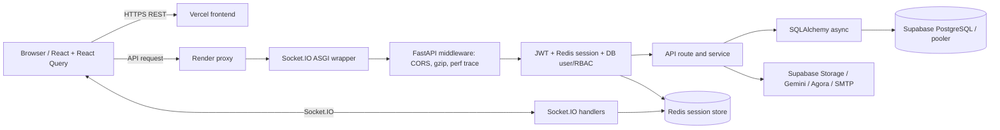
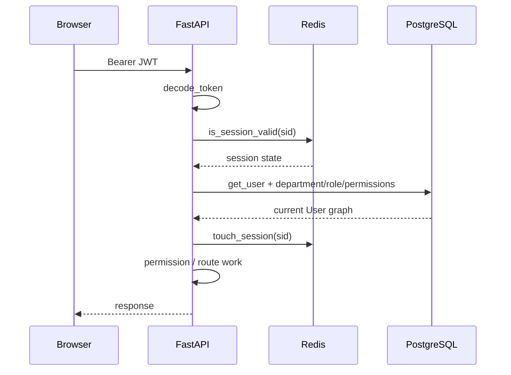
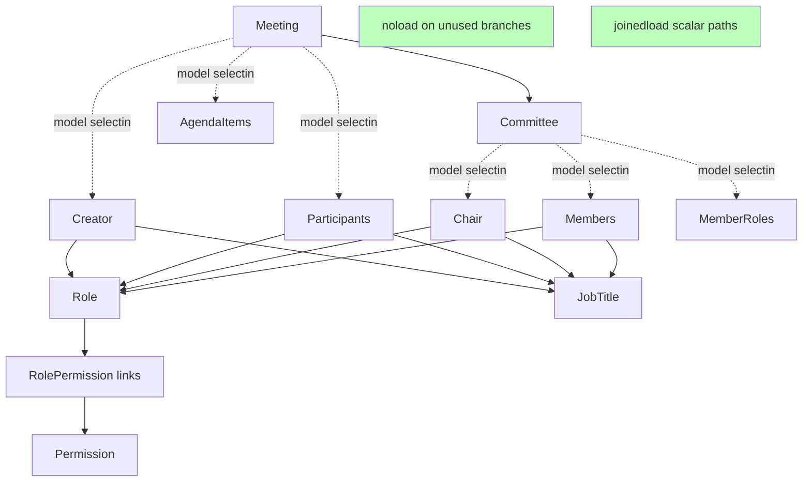

# Performance Audit

**Audit basis:** static review of the `full-code-audit` branch and measurement notes embedded in the code, 2026-09-15.

**Scope:** React/Vite frontend, FastAPI/Socket.IO backend, Redis, SQLAlchemy/asyncpg, PostgreSQL/Supabase, Render, Supabase Storage, and Gemini integrations.

**Important:** this is an evidence report, not a production benchmark. Historical timings recorded in source comments are identified as such; current production latency, traffic, data volume, provider metrics, and query plans were not available.

## 1. Executive summary

The reported 20–30 second experience is best explained by accumulated remote round trips rather than CPU work. Every authenticated REST request performs two Redis operations and a database user/permission load before route work begins. Model-level `lazy="selectin"` relationships previously expanded a minutes request into many sequential SQL statements. Repository instrumentation records **47 SQL statements and 17.5 seconds** for a real `/minutes` request before eager-loading changes. The current code contains deliberate `joinedload`/`noload` fixes, but no post-fix production sample is present, so the current latency is not confirmed.

There is also one confirmed correctness failure in the current request path: `backend/app/main.py:perf_trace_middleware` assigns `perf_probe.trace_summary()` to `X-Perf-Trace`. Trace labels and SQL parameters can contain Arabic characters, while Starlette encodes response headers as Latin-1. The failure occurs after the endpoint has returned, during response/header construction, and can turn an otherwise successful meeting-minutes request into a 500 response that the browser may present as a CORS/network error. The trace is also allowed to reach 30,000 characters, which is unsafe for common proxy header limits.

Highest-value order: remove or ASCII-safe the diagnostic response header; retain server-side structured timing; measure the three isolation endpoints/request classes; reduce authentication and ORM round trips; then address page request fan-out and external-service work.

## 2. Architecture and request paths

```mermaid
flowchart LR
    T0[Request arrives] --> M[Middleware overhead]
    M --> J[JWT decode]
    J --> R1[Redis session GET]
    R1 --> UQ[DB user + role + permissions]
    UQ --> R2[Redis session touch/expiry]
    R2 --> B[Business queries]
    B --> O[ORM relationship expansion]
    O --> Z[Pydantic serialization]
    Z --> H[Perf header encoding]
    H --> N[Proxy/network transfer]
    style H fill:#f99
```





The phases are sequential within one request. If the browser starts several protected queries for a page, the authentication prefix repeats for every query.

### Authentication flow



### ORM graph expansion



Dashed branches describe the expansion risk documented in `meeting_minutes_service.py`. Current minutes loaders explicitly suppress most unused branches and join scalar paths.

### Meeting-minutes flow

```mermaid
sequenceDiagram
    participant UI as MeetingMinutesPage
    participant MW as perf_trace_middleware
    participant Auth as get_current_user
    participant Svc as meeting_minutes_service
    participant DB
    UI->>MW: GET /api/v1/meetings/{id}/minutes
    MW->>Auth: call_next
    Auth->>DB: user/RBAC graph
    Auth-->>Svc: current user
    Svc->>DB: meeting + committee/chair (joined; unused paths noload)
    Svc->>DB: committee permission query when needed
    Svc->>DB: minutes + owner/reviewers/signatures (joined)
    Svc-->>MW: MeetingMinutesOut response
    MW->>MW: set X-Perf-Trace with Unicode
    Note over MW: CONFIRMED post-route Latin-1 header failure
    MW--xUI: 500 / apparent network or CORS error
```

## 3. Evidence classification and ranked root causes

Definitions used throughout:

- **CONFIRMED:** directly established by current code or an explicit recorded measurement.
- **STRONGLY SUSPECTED:** code supplies a direct latency mechanism, but current production timing is absent.
- **POSSIBLE:** plausible and testable; evidence does not establish material impact.
- **INSUFFICIENT EVIDENCE:** provider/runtime data or measurements are missing.
- **NOT A PROBLEM:** code evidence contradicts the suspected mechanism, or work is explicitly off the response path.

| Rank | Finding | Classification | Evidence and consequence |
|---:|---|---|---|
| 1 | Unicode diagnostic header crashes after route completion | **CONFIRMED** | `main.py:perf_trace_middleware` writes unrestricted trace text to `response.headers["X-Perf-Trace"]`; `perf_probe` labels, callers, SQL/parameters, and application data can contain Arabic. Starlette headers require Latin-1. This is the identified minutes post-route failure. |
| 2 | Historical minutes ORM/query explosion | **CONFIRMED** historically | `meeting_minutes_service.py` records 47 sequential statements and 17.5 s on a real `/minutes` request, and identifies automatic `selectin` cascades. It also records a later 65→15 reduction. Current loaders are substantially changed; current impact is unmeasured. |
| 3 | Fixed authentication tax on every protected REST request | **STRONGLY SUSPECTED** | `dependencies.py:_resolve_user_from_token` performs Redis validation, `user_service.get_user`, and Redis touch for each request. Page fan-out multiplies the tax. |
| 4 | Remote DB round-trip latency amplified by eager defaults | **STRONGLY SUSPECTED** | Many model relationships use mapper-level `lazy="selectin"`; comments and trace callers document automatic secondary statements. The minutes path now uses targeted `joinedload`/`noload`, but other services remain exposed. |
| 5 | Oversized `X-Perf-Trace` header | **STRONGLY SUSPECTED** | Up to 30,000 characters are emitted on every traced response. Proxy limits vary; rejection/truncation and response bloat are credible. It is diagnostic data, not product data. |
| 6 | Multiple independent page queries | **POSSIBLE** | React Query hooks independently fetch lists, details, attachments, chat, recording, draft, extracted items, minutes, templates, and notification count. Exact concurrent request sets depend on component state and permissions. |
| 7 | Render free-service cold start | **INSUFFICIENT EVIDENCE** | `render.yaml` specifies a free web service, but no Render sleep/start logs or `/performance-test` samples were supplied. |
| 8 | Supabase/pooler saturation | **POSSIBLE** | `session.py` documents a prior session-mode `EMAXCONNSESSION`, later use of the transaction pooler, and a 10+10 application pool. No current pool wait or Supabase metrics are available. |
| 9 | Redis itself is the dominant 20–30 s cause | **NOT A PROBLEM** as an established claim | Timeouts are 3 seconds and only two operations occur per normal protected request. Redis can still add latency/failures, but evidence does not support 20–30 s dominance. |
| 10 | Background document embedding/email blocks normal response | **NOT A PROBLEM** for route latency | These are registered as FastAPI background tasks after the response is prepared. They can consume worker resources later, but are not awaited in the route response path. |

## 4. Layer findings

### Frontend

React Query prevents duplicate in-flight work for an identical key, but pages use many different keys. `AppBootstrap` also blocks initial protected rendering on `/users/me` after refresh; the shell can fetch unread notifications, after which the page starts its own queries. Detail-heavy meeting screens have separate hooks for meeting, chat, attachments, recording, draft, extracted items, minutes, templates, tasks, and decisions. This is useful separation, but each protected HTTP query repeats the full authentication prefix. **POSSIBLE** fan-out bottleneck; measure before consolidating. Vite code splitting, bundle size, Web Vitals, and browser main-thread cost were not measured (**INSUFFICIENT EVIDENCE**).

### Backend and middleware

The application is one Uvicorn process (`Dockerfile` has no `--workers`) wrapped by `socketio.ASGIApp`. Async I/O permits concurrency, but CPU-heavy work or pool waits affect all traffic. GZip applies above 1 KB and is **NOT A PROBLEM** absent CPU evidence. The global exception handler manually restores CORS headers for 500s. The performance middleware is currently invasive: it formats all SQL trace data, prints synchronously, adds two response headers, and can fail during header encoding. Diagnostic middleware must never be able to change request success.

### Authentication and Redis

JWT decoding is local and likely small (**POSSIBLE**, not measured). Session validation and sliding-expiration touch are two network round trips per protected request. The user is fetched from PostgreSQL every time by design so suspension and permissions are current. That is secure but expensive across page fan-out. Redis uses 3-second connect and command timeouts, `decode_responses=True`, and a Render Frankfurt free key-value service with `allkeys-lru`. Eviction can invalidate sessions; it is a correctness risk, not proven latency. Socket.IO authenticates at connect and stores the resolved user in its Socket.IO session, avoiding per-event REST authentication; that is **NOT A PROBLEM** for repeated socket events.

### SQLAlchemy/ORM and database

`AsyncSessionLocal` uses `expire_on_commit=False`. The engine enables `pool_pre_ping`, `pool_recycle=300`, `pool_size=10`, and `max_overflow=10`; these help stale connections but add a checkout ping when required and can create up to 20 backend connections per process. Source history documents pool exhaustion when long-lived WebSocket dependencies held sessions; `get_current_user_ws` now opens a short-lived session, so that specific leak is **NOT A PROBLEM** in the current implementation.

Mapper-level `selectin` is widespread across User, Role, Committee, Meeting, Decision, Task, Document, and minutes models. It is eager loading, not a harmless lazy access: loading a root can automatically trigger secondary queries for relationships not serialized. Current minutes code correctly uses `noload` for unused user role/job-title and meeting creator/participants/member-role branches, `joinedload` for scalar meeting→committee→chair, and a joined minutes graph. Joining both reviewers and signatures creates a reviewer×signature row multiplication; the code calls `.unique()`, making it correct, but large committees may shift cost from latency to transferred rows (**POSSIBLE**). No `EXPLAIN ANALYZE`, table cardinalities, slow-query log, index hit ratios, or database CPU/I/O metrics were supplied (**INSUFFICIENT EVIDENCE**).

### Socket.IO

The Socket.IO server is in-process and holds presence/session state per server process. With the current single process this is consistent. Scaling to multiple workers/instances would require a shared Socket.IO manager and sticky/routed connections; that is a future scaling constraint, not the reported REST delay. Connect performs authentication/database work once. Long-lived database sessions were explicitly removed.

### Files and documents

Uploads/downloads proxy full byte content through the backend to Supabase Storage using a new `httpx.AsyncClient` with a 30-second timeout. This adds browser→Render→Supabase transit and buffers bytes in application memory; **STRONGLY SUSPECTED** for large-file operation latency, not ordinary JSON pages. `documents.py` already constructs an ASCII `Content-Disposition` fallback, so the documented filename Unicode failure is **NOT A PROBLEM** in the current download header path. Text extraction and exact file-size distributions were not timed.

### AI

Gemini audio generation can wait for upload, file activation, and generation under a 180-second client timeout. Semantic search/chat and extraction use 30–60-second timeouts. These operations are inherently external and should have their own UX/SLO. Document embedding is scheduled in the background after upload (**NOT A PROBLEM** for initial upload response), although FastAPI in-process background tasks still share process resources and are not durable. AI latency is **INSUFFICIENT EVIDENCE** without request samples.

### Render and Supabase

Render backend, Redis, and the declared region are Frankfurt. The Supabase project region is not declared in this repository. Cross-region distance could multiply every SQL and Storage round trip (**POSSIBLE**); verify regions rather than infer them. A free Render plan may sleep or throttle, but no current provider data establishes this. `/performance-test` isolates proxy/app overhead and `/performance-db-test` isolates connection plus `SELECT 1`; they are the right first measurements. `/health` does not test dependencies and must not be used as a DB/Redis health claim.

## 5. Page-by-page request and bottleneck inventory

“Redis ops” counts the normal REST authentication prefix: one session validation plus one touch. It excludes login/logout and Socket.IO connect. Counts are per API request, not per page; multiply by the requests actually enabled.

| UI route/page | Primary API work visible from hooks | Redis operations | Other dependencies | Likely bottleneck / status |
|---|---|---:|---|---|
| `/login` | login, optionally session creation | login writes session | DB, bcrypt | Password hashing deliberately costs CPU; measure, do not weaken. |
| app bootstrap/profile | `/users/me` | 2/request | DB user/RBAC graph | Blocking refresh bootstrap; auth round trips **STRONGLY SUSPECTED**. |
| `/dashboard` | dashboard summary + shell unread count | 2/request | DB, Redis cache for unread count | Multiple protected calls; query complexity unmeasured. |
| `/users` | users list | 2/request | DB user/role/department graphs | Collection graph size and eager relationships. |
| roles/detail | roles, permissions, role detail | 2/request | DB | Separate keys/calls; permission collection expansion. |
| job titles | job-title list | 2/request | DB | Primarily fixed auth tax unless list is large. |
| departments/detail | list/detail and members | 2/request | DB | User/department/manager eager graph. |
| committee requests/detail | request list/detail, eligible members | 2/request | DB | Proposed-member/user graph and parallel lookup calls. |
| committees/detail | committee list/detail, optional department search | 2/request | DB | Members, chair, roles, permissions; mapper eager expansion risk. |
| documents | document list/categories | 2/request | DB | Visibility collections and uploader/category graph. |
| document detail | detail; download on action; chat conversations | 2/request | DB, Supabase Storage | Proxied file bytes for download; separate chat queries. |
| document smart search | semantic search/chat | 2/request | DB/pgvector, Gemini | External AI and vector query dominate by design; current timing unknown. |
| meetings | meeting list | 2/request | DB | Meeting/committee/participant/agenda relationship breadth. |
| meeting detail | detail, chat, attachments, recording, draft, extracted items, decisions; Socket.IO | 2 per REST request; connect auth once | DB, Socket.IO, Storage, Agora/Gemini on action | Highest request fan-out; auth multiplication and ORM graphs. |
| minutes list | finished/eligible meetings or minutes list | 2/request | DB | Meeting list graph; current query count unmeasured. |
| meeting minutes detail | meeting detail, minutes, templates depending on state | 2 per REST request | DB, Socket.IO | Historical 47 queries/17.5 s; current loader improved; **confirmed Unicode header failure**. |
| decisions/detail | list/detail, meeting-filtered list | 2/request | DB | Assignees/options/votes/user graphs. |
| tasks/detail | list/detail/activity | 2/request | DB | Detail plus independent activity query and relationship graphs. |
| notifications | list plus shell unread count | 2/request | DB, Redis count cache | Cache helps count query; invalidations can add Redis work. |

This table is a static request inventory. Exact request counts, ordering, cache hits, cancellations, and payload sizes require browser network traces.

## 6. Meeting-minutes forensic trace

1. `MeetingMinutesPage` enables distinct React Query hooks for meeting/minutes/templates according to page state. Each is a separate protected REST request.
2. `backend/app/main.py:perf_trace_middleware` calls `perf_probe.start_trace()` and wraps `call_next` in a default caller label.
3. `get_current_user` decodes the token, awaits `is_session_valid`, loads the authoritative user and permission graph, and awaits `touch_session`.
4. Minutes route logic loads meeting context. `_load_meeting` now joins committee/chair and explicitly prevents unused creator, participants, member roles, members, agenda, role, and job-title branches unless requested.
5. Access may query committee-role permission codes.
6. `_load_minutes_row` joins owner, reviewers/users, and signatures/users in one round trip and calls `.unique()` to reconstruct collections.
7. The route converts the loaded objects to `MeetingMinutesOut` and returns successfully to middleware.
8. Middleware computes the summary. `perf_probe.trace_summary()` includes caller labels, SQL fragments/parameters, and timings; Arabic values are possible and source labels already contain non-ASCII punctuation/text.
9. `response.headers["X-Perf-Trace"] = trace_str[:30000]` stores that Unicode value. Starlette’s raw-header conversion encodes header values as Latin-1. Any character outside Latin-1 raises `UnicodeEncodeError`.
10. This exception is **post-route**: the business operation may have completed and committed. It is raised by `backend/app/main.py:perf_trace_middleware`, not by CORS, the minutes service, Redis, or response JSON encoding. The outer 500 path can therefore appear in the browser as a network/CORS failure, especially if proxy/error handling does not preserve expected headers.

The classification is **CONFIRMED** from the current code path and encoding contract. The specific production frequency is not known because raw failing traces/logs were not supplied.

## 7. Recommended fix order (documentation only)

1. **P0 — make tracing non-fatal.** Remove `X-Perf-Trace` from production responses. Keep a short ASCII trace ID and numeric `Server-Timing`/`X-Perf-Total-Ms` only if required. Log structured trace data server-side; sanitize CR/LF and cap size. Wrap diagnostics so they can never replace a valid response.
2. **P0 — capture a clean baseline.** Measure `/performance-test`, `/performance-db-test`, one authenticated `/users/me`, meeting list/detail, and minutes detail from the same client, warm and cold.
3. **P1 — validate current minutes gains.** Record total SQL count, DB cumulative time, pool checkout time, auth time, serialization time, total app time, and browser TTFB. Confirm current v6 markers and compare with the recorded 47/17.5 s baseline.
4. **P1 — reduce fixed auth round trips safely.** Consider one atomic Redis validate-and-touch operation; cache only carefully bounded user/RBAC data with explicit invalidation/versioning. Preserve immediate suspension, logout, and permission-change semantics.
5. **P1 — audit mapper eager defaults route by route.** Prefer query-specific eager plans and `lazy="raise"`/neutral defaults where feasible. Add SQL-count regression tests for minutes, meeting detail, committees, users, decisions, tasks, and documents.
6. **P1 — verify database topology and pools.** Confirm Supabase region and transaction-pooler endpoint; measure pool waits; size engine pools against actual Supabase limits and Render instance count.
7. **P2 — reduce frontend fan-out.** From a browser trace, combine only calls that are always consumed together, delay tab/action data until needed, choose intentional `staleTime`, and avoid broad invalidations. Do not trade clarity for aggregation without measurements.
8. **P2 — optimize files/external work.** Reuse HTTP clients, stream large transfers, and consider signed direct transfers if authorization policy permits. Put long AI work on a durable job queue with status polling/events.
9. **P2 — productionize observability.** Replace temporary SQL/header tracing with sampled metrics, request IDs, dependency spans, safe cardinality, and alerts tied to SLOs.
10. **P3 — scale Socket.IO deliberately.** Before multiple workers/instances, add a shared client manager and validate connection routing; keep DB sessions scoped to individual operations.

## 8. Measurement plan and acceptance gates

### Test matrix

Run at least 30 samples per case, separating first/cold from warm samples:

| Case | What it isolates | Record |
|---|---|---|
| `GET /performance-test` | Render/proxy/Uvicorn/middleware/network | DNS, connect, TLS, TTFB, app total, cold/warm |
| `GET /performance-db-test` | Above + DB checkout + `SELECT 1` | pool wait, connect/pre-ping, query time |
| `GET /api/v1/users/me` | Auth baseline | JWT, Redis validate, user SQL count/time, Redis touch |
| meeting list/detail | Common ORM and payload | request count, SQL count/cumulative time, rows/bytes, serialization |
| minutes detail | Investigated critical flow | all above, v6 markers, status, header/log errors |
| document download (small/large) | Storage proxy path | first byte, throughput, memory, Storage latency |
| semantic search / draft generation | AI dependency | queue/wait, provider latency, timeout/retry rate |
| Socket.IO connect and 100 events | realtime auth/event cost | connect latency, DB sessions checked out, event p95 |

Test an empty/small dataset and a production-shaped seeded dataset; run from the primary user geography. Capture browser HAR, Render request/start logs, safe application spans, Redis command latency, SQLAlchemy pool checkout/checkin, and Supabase query/pool metrics. Correlate all layers using one request ID. Do not put SQL parameters, tokens, PII, document text, or Arabic business data in headers.

### Metrics and provisional gates

- Report p50, p95, p99, error rate, TTFB, response bytes, and cold-start rate separately.
- Break application time into middleware, authentication, Redis, pool wait, SQL execution, external calls, serialization, and background scheduling.
- Track SQL statement count and cumulative DB time per named route; fail regression tests when stable read routes exceed their recorded budgets.
- Initial investigation gates (to be ratified against product SLOs): warm `/performance-test` p95 < 500 ms; warm `/performance-db-test` p95 < 1 s; no protected JSON page request > 3 s p95; no minutes response failure due to diagnostics; zero pool timeouts; zero Unicode/header exceptions.
- Compare before/after with identical region, dataset, account permissions, cache state, and sample count. A change is accepted only if it improves user-visible p95 without increasing errors or weakening authorization/session semantics.

## 9. Scope and evidence limits

This audit inspected repository source and its embedded investigation notes. It did not execute production requests, access Render/Supabase/Redis dashboards, inspect a browser HAR, run database query plans, measure data cardinality, or load-test concurrent users. Therefore:

- the historical 47-query/17.5-second minutes result is confirmed as recorded evidence, not claimed as the current branch result;
- cold starts, cross-region traffic, pool saturation, Redis latency, frontend bundle cost, and external provider latency remain hypotheses until measured;
- code comments are useful investigation artifacts but do not replace reproducible telemetry;
- security-driven behavior (authoritative user lookup, session invalidation, RBAC) must not be removed merely to improve a benchmark;
- no application code, deployment configuration, dependency, or migration change is part of this report.

## 10. Evidence index

| Area | Primary repository evidence |
|---|---|
| Request tracing/header failure | `backend/app/main.py:perf_trace_middleware`, `backend/app/core/perf_probe.py` |
| Authentication/Redis | `backend/app/core/dependencies.py:_resolve_user_from_token`, `backend/app/core/redis_client.py` |
| DB engine/pool history | `backend/app/db/session.py` |
| Minutes query history and current loading | `backend/app/services/meeting_minutes_service.py:_load_meeting`, `_load_minutes_row` |
| Routes and response conversion | `backend/app/api/v1/meetings.py` |
| ORM eager defaults | `backend/app/models/*.py`, `backend/app/services/*.py` |
| Frontend routes/queries | `frontend/src/App.tsx`, `frontend/src/hooks/*.ts`, `frontend/src/features/**` |
| Socket.IO | `backend/app/core/socketio_server.py`, `backend/app/main.py:socket_app` |
| Storage and Unicode filename handling | `backend/app/core/storage_client.py`, `backend/app/api/v1/documents.py` |
| AI | `backend/app/core/gemini_client.py`, document/meeting services |
| Hosting | `render.yaml`, `backend/Dockerfile`, `frontend/vercel.json` |
