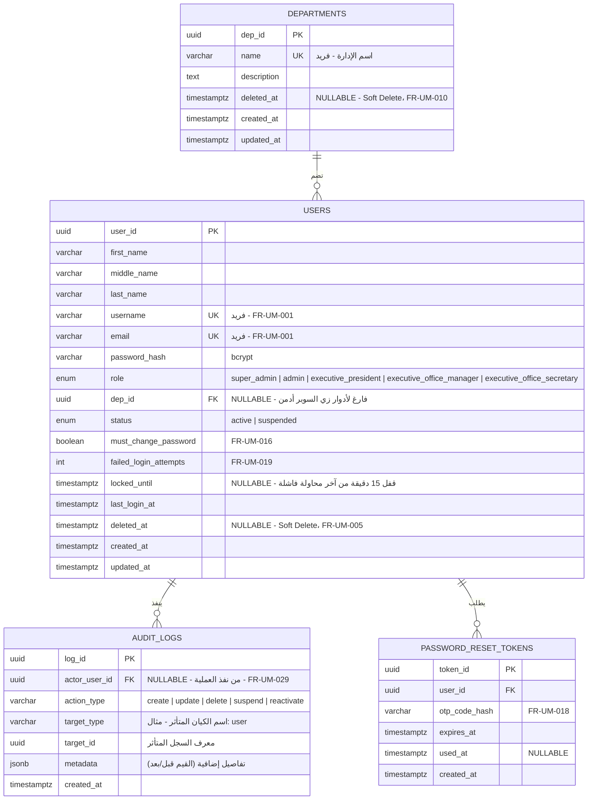

# ERD — المرحلة 2: إدارة المستخدمين والإدارات

## نطاق هذا الـ ERD

يغطي الجداول اللازمة لتنفيذ المتطلبات التالية من `SRS` (قسم 1 — إدارة المستخدمين، الفروع 1.1 إلى 1.4 و6.1) و`BRS`:

- إدارة حسابات المستخدمين (FR-UM-001 → FR-UM-007)
- إدارة الإدارات (FR-UM-007 → FR-UM-010)
- إدارة أعضاء الإدارات (FR-UM-011 → FR-UM-014)
- تسجيل الدخول والمصادقة (FR-UM-015 → FR-UM-022)
- التحكم في الوصول والأمان / Audit Log (FR-UM-026 → FR-UM-029)

**خارج النطاق هنا (Phase 3 لاحقًا):** الأدوار المرتبطة باللجان — رئيس لجنة / عضو لجنة / صلاحية "مطلع CC" / عضو بديل (FR-UM-023 → FR-UM-025) — لأنها ترتبط بجدول "اللجان" اللي لسه ما صممناه. أشرت لها كنقطة اعتمادية بالأسفل، وما أنشأت جدول لها الآن حتى ما نبدأ مرحلة اللجان قبل اعتمادها.

## اتفاقية التسمية (Naming Convention)

ما فيه كود موجود بالمشروع حاليًا، فأنا مقترح الاتفاقية التالية (وبنلتزم فيها بكل الجداول الجاية بعدين حسب قاعدة "لا تغيّر بنية قائمة إلا بطلب صريح"):

- أسماء الجداول: `snake_case` وبصيغة الجمع (`users`, `departments`).
- أسماء الأعمدة: `snake_case`.
- المفتاح الأساسي: `UUID`، باسم مختصر مرتبط بالجدول بدل `id` العام — حسب طلبك (مثال: `dep_id` لجدول `departments`، `user_id` لجدول `users`). نفس الاسم يُستخدم بالـ Foreign Key بالجداول الثانية اللي تشير له (مثال: `users.dep_id` يشير لـ `departments.dep_id`).
- كل جدول فيه `created_at` و`updated_at` (Timestamps إلزامية حسب قاعدة "Status وTimestamps" في CLAUDE.md).

## ERD (Mermaid)

## ملاحظات تصميمية مهمة

- **الأدوار (role):** استخدمت `enum` ثابت للأدوار العامة (Global Roles) بدل جدول `roles` منفصل، لأن القائمة صغيرة ومحددة حسب `BRS` (الرئيس التنفيذي، المكتب التنفيذي بمستوييه، السوبر أدمن، الأدمن). أدوار اللجان (رئيس/عضو لجنة) **مو** جزء من هذا الـ enum لأنها Scoped لكل لجنة على حدة (نفس المستخدم يقدر يكون رئيس بلجنة وعضو بلجنة ثانية — FR-UM-023) وهذا يحتاج جدول ربط منفصل بمرحلة اللجان.
- **Session Tracking:** حسب قسم "إدارة الجلسات" في `CLAUDE.md`، تتبع الجلسات النشطة وإبطال التوكن يكون عبر **Redis** جنب الـ JWT، فما أضفت جدول `sessions` بقاعدة البيانات الرئيسية — الجلسات تدار في Redis منفصلة. أخبرني إذا تبي بدلها جدول SQL بدل Redis.
- **Audit Log:** صممته Append-only (بدون Update/Delete)، ويربط بالمستخدم المنفذ (`actor_user_id`) لا بالمستخدم المتأثر، مع `target_type` + `target_id` بشكل عام عشان يصلح لأي كيان مستقبلي (مو بس users) بدون ما نعدل بنيته لاحقًا.
- **Soft Delete على users:** أضفت عمود `deleted_at` (Nullable). الحذف (FR-UM-005) يكون تحديث لهذا العمود بدل حذف السجل فعليًا، فتبقى كل الارتباطات التاريخية (مهام/قرارات/محاضر موقّعة) سليمة. تبعات مهمة على التنفيذ:
  - كل الاستعلامات الافتراضية لازم تستثني `WHERE deleted_at IS NULL`.
  - قيود التفرد (`UNIQUE` على `email` و`username`) لازم تكون **Partial Unique Index** (`WHERE deleted_at IS NULL`) مو Unique عادي، عشان يصير ممكن نعيد استخدام نفس البريد/اسم المستخدم لحساب جديد بعد ما نحذف القديم Soft.
  - رسالة "وصول مرفوض" (FR-UM-028) لازم تُرجع لأي محاولة وصول لمستخدم محذوف Soft، بنفس معاملة المستخدم الموقوف تقريبًا.
- **Soft Delete على departments (تصحيح):** كانت ناقصة بالنسخة السابقة رغم إن FR-UM-010 يتيح حذف الإدارة — أضفتها الحين بنفس منطق `users` (`deleted_at` + Partial Unique Index على `name`)، لنفس السبب: إدارة محذوفة قد يكون مرتبط فيها مستخدمين تاريخيًا (`users.dep_id`)، فـ Hard Delete كان يكسر هالارتباط أو يحتاج نمنع الحذف كليًا لو فيها أعضاء. لو تفضل غير كذا (مثلًا: يمنع حذف الإدارة أصلًا إذا فيها أعضاء نشطين، بدل Soft Delete)، وضحلي.
- **تقسيم الاسم:** فصلت `full_name` إلى `first_name` و`middle_name` و`last_name` — الثلاثة إلزاميين (`NOT NULL`).

## القرارات المعتمدة (بناءً على ردك)

- **مدة قفل الحساب:** 15 دقيقة من آخر محاولة فاشلة (قيمة افتراضية، أنا اخترتها كإعداد Config قابل للتعديل لاحقًا من إعدادات النظام مو Hardcoded دائم — قلي إذا تبي رقم مختلف).
- **الحذف (FR-UM-005):** Soft Delete معتمد — انعكس بالتصميم أعلاه (`deleted_at`).
- **FR-UM-014 (السوبر أدمن يضيف أعضاء لإدارته):** تأكد إنه مو تعارض ولا خطأ مطبعي — السوبر أدمن فعليًا هو من يضيف الأعضاء للإدارات (صلاحية عامة على كل الإدارات، مو إنه "منتمي" لإدارة معينة). هذا متسق مع FR-UM-011 وما يغيّر شي بالتصميم: `department_id` يبقى Nullable للسوبر أدمن نفسه (لأنه ما ينتمي لإدارة)، بينما الأعضاء اللي يضيفهم يكون عندهم `department_id` معبّى.
- **الإيقاف المؤقت (FR-UM-004):** `status = suspended` يمنع تسجيل الدخول فقط (نتحقق منه بمرحلة الـ Authentication بالـ Backend). بياناته تبقى ظاهرة بباقي الشاشات (كعضو لجنة مثلًا) بدون إخفاء — ما يحتاج عمود إضافي، `status` الحالي كافي.
- **انتماء المستخدم لإدارة:** مؤكد — إدارة واحدة بس لكل مستخدم. `department_id` يضل عمود مفرد (مو جدول ربط Many-to-Many).

## الحالة

✅ لا توجد نقاط مفتوحة. التصميم معتمد ونهائي لهذه المرحلة (إدارة المستخدمين والإدارات)، وتم تحويله لملفات SQL Migrations فعلية في `db/migrations/`.
